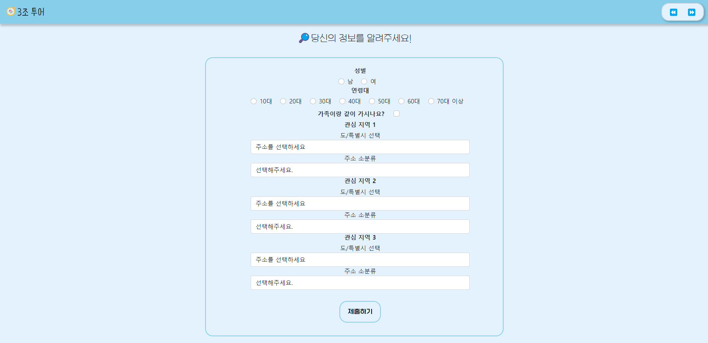

# Personalized-Travel-Recommendation-Service
개인 맞춤형 여행지 추천 서비스

 

## Project Members
**최전석** : Team Leader, Data Engineer, Data Analyst
- 블로그 데이터 크롤링
- Hadoop 클러스터 구축  
- 협업 필터링을 통한 유사집단 기반 추천 알고리즘 개발
- 군집화 결과 시각화

 

**양미숙** : Backend Engineer
- 요구사항 분석
- DB 테이블 작성
- Django 코드 작성
- 로컬 웹사이트 작성

 

**양정아** : Data Analyst
- 국민여행조사 데이터 전처리
- 키워드 추출 및 시각화
- 감성분석 기반 긍/부정 키워드 추출
- 군집화 결과 시각화

 

**이종우** : Frontend Engineer
- 웹사이트 구조도 작성
- HTML 작성
- CSS 작성
- JavaScript 작성
- 웹사이트 배포

 

**한진서** : Data Analyst
- 데이터 수집
- 블로그 데이터 전처리
- 키워드 추출 및 임베딩 및 군집화
- 군집화 결과 및 유사도 기반 추천 알고리즘 개발

 

**홍중기** : Data Analyst
- 데이터 수집
- 국민여행조사 데이터 전처리
- 협업 필터링 관련 자료 조사

 

## Service Introduction
1. **유사집단 기반 여행지 추천**   
성별, 연령대, 가족 여행 여부에 대한 사용자 정보를 기반으로 사용자와 유사한 특징을 가진 집단이 선호하는 여행지 추천     

2. **관심 지역과 유사한 특징을 가진 여행지 추천**   
여행지에 대한 블로그 내용을 기반으로 사용자가 선택한 관심 지역과 유사한 특징을 가진 여행지 추천

3. **추천 여행지에 대한 정보 제공**   
추천 여행지에 대해 블로그 내용 기반 키워드 트리맵과 긍/부정 키워드 및 인기 관광지 리스트 제공

 

## Tech Stacks

 

## Data
1. **국민여행조사**  
- **컬럼 정보** : 성별, 연령, 방문지, 동반자유형, 전반적만족도, 재방문의도, 타인추천의도 등
- **데이터 개수** : 100,310개
- **제공처** : 한국문화관광연구원

 

2. **블로그**  
- **수집 정보** : 제목, 내용
- **데이터 개수** : 72,521개
- **제공처** : 네이버

 

3. **인기관광지**
- **수집 정보** : 주요 유료관광지점 입장객 수(전체), 인기 관광지(전체)
- **데이터 개수** : 750개
- **제공처** : 한국관광 데이터랩(한국관광공사)

 

## Output View   
1. 홈 화면      

 

2. 사용자 정보 입력 화면

